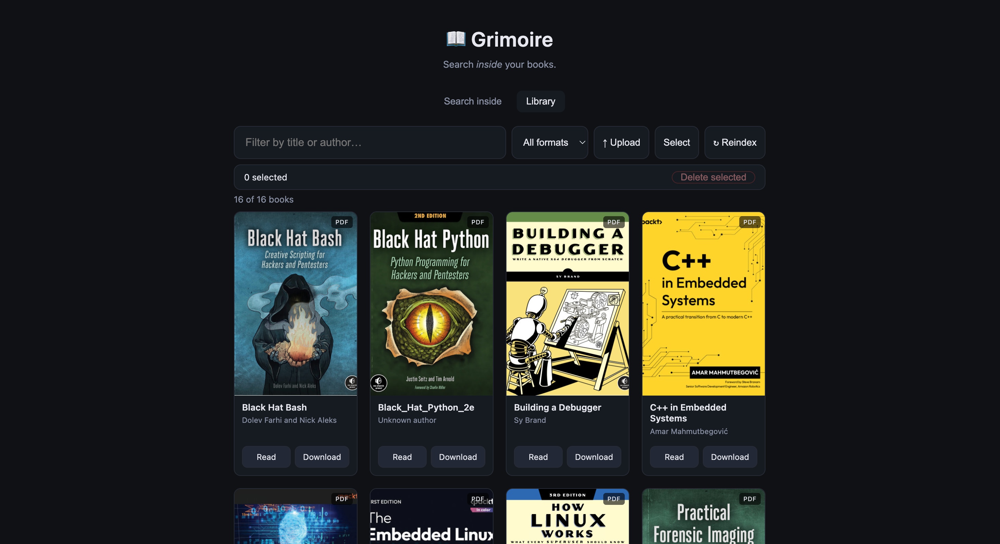
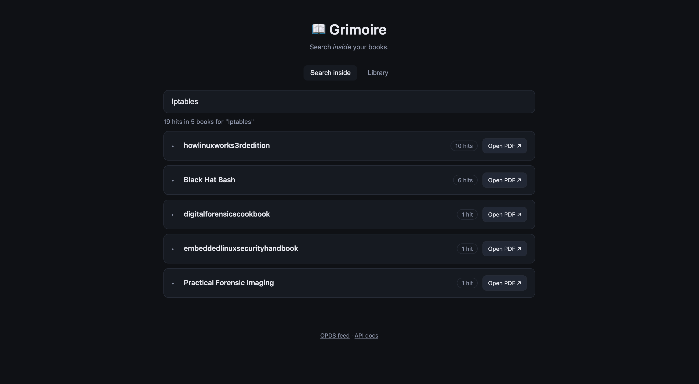

# Grimoire

Self-hosted library for books, with full-text search that actually
searches *inside* the books.

Search "example" → get every book containing it, the matching page, a
highlighted excerpt, and a link that opens the PDF at that exact page.
It will also have a drop down per book to help with having too many results
clog up the screen. 

## Screenshots 




---

## Why

Calibre-Web, Kavita, and Komga all serve files well, but none of them search
book contents. Calibre itself has FTS5 indexing but locks it in the desktop
app. I wanted to make Grimoire to be the missing piece.

## Features

- [ ] Per-page full-text search across PDFs (EPUBs catalogued for download only)
- [ ] Ranked results (BM25) with highlighted snippets
- [ ] Deep links into pdf.js at the matching page
- [ ] Idempotent indexer - hash-based, safe to re-run
- [ ] OPDS feed
- [ ] OCR pass for scanned books
- [ ] Semantic search via sqlite-vec

## Stack

| Layer     | Choice                | Why                                  |
|-----------|-----------------------|--------------------------------------|
| Extract   | PyMuPDF, ebooklib     | PDF text/pages; EPUB metadata only   |
| Index     | SQLite FTS5           | No extra service, `snippet()` builtin|
| API       | FastAPI               | Async, auto docs                     |
| Reader    | pdf.js                | `#page=N` deep links                 |
| Frontend  | One HTML file         | It's a search box                    |

## Layout

```
grimoire/
├── books/              # source files, git-ignored
├── grimoire.db         # disposable, rebuild anytime
├── indexer/
│   ├── walk.py         # discover + hash files
│   ├── extract.py      # PDF → (page, text); EPUB → metadata only
│   └── index.py        # write to FTS5
├── api/
│   ├── main.py         # FastAPI routes
│   └── search.py       # query + snippet formatting
├── web/
│   ├── index.html
│   └── pdfjs/
└── README.md
```

## Schema

```sql
CREATE TABLE books (
  id       INTEGER PRIMARY KEY,
  path     TEXT UNIQUE NOT NULL,
  sha256   TEXT NOT NULL,        -- skip re-index if unchanged
  title    TEXT,
  author   TEXT,
  format   TEXT,                 -- pdf | epub
  pages    INTEGER,
  added_at TEXT
);

CREATE VIRTUAL TABLE chunks USING fts5(
  text,
  book_id  UNINDEXED,
  page     UNINDEXED,
  label    UNINDEXED,            -- chapter / section name
  tokenize = 'porter unicode61'
);
```

Query:

```sql
SELECT b.title, c.page, c.label,
       snippet(chunks, 0, '<mark>', '</mark>', '…', 20) AS excerpt,
       bm25(chunks) AS rank
FROM chunks c JOIN books b ON b.id = c.book_id
WHERE chunks MATCH ?
ORDER BY rank
LIMIT 50;
```

## API

| Method | Route             | Notes                                  |
|--------|-------------------|----------------------------------------|
| GET    | `/search?q=`      | `&limit=`, `&format=`, `&book=`        |
| GET    | `/books`          | List with metadata                     |
| GET    | `/book/{id}`      | Detail + per-book hit counts           |
| GET    | `/download/{id}`  | Raw file, supports range requests      |
| GET    | `/opds`           | OPDS catalog                           |
| POST   | `/reindex`        | Kick off a scan                        |

## Setup

```bash
git clone <repo> grimoire && cd grimoire
python -m venv .venv && source .venv/bin/activate
pip install -r requirements.txt

cp .env.example .env      # set BOOKS_DIR
python -m indexer.index   # first run: a few min per 100 books
uvicorn api.main:app --reload
```

Open `http://localhost:8000`.

## Indexing

Re-run `python -m indexer.index` after adding books. Files are hashed, so
unchanged books are skipped. Cron it:

```
*/30 * * * * cd /srv/grimoire && .venv/bin/python -m indexer.index
```

Scanned PDFs have no text layer and index empty. Run them through OCR first:

```bash
ocrmypdf --skip-text in.pdf out.pdf
```

## Design notes

**Per-page rows, not per-book.** This is the whole trick. One row per book
gives you "this book mentions it somewhere"; one row per page gives you
*"Nmap Network Scanning, p. 212"* plus a working deep link.

**The DB is disposable.** Books are plain files on disk. Everything else
rebuilds from scratch. Never be afraid to `rm grimoire.db`.

**Section labels** come from the PDF outline (PyMuPDF `doc.get_toc()`) mapped
to page ranges. Fall back to page number when absent.

## Roadmap

- Tags and collections
- Reading progress
- Semantic search (`sqlite-vec` table alongside FTS)
- MCP server — query the library from an LLM
- Highlight boxes in the reader using PyMuPDF `search_for()` rects

## License

MIT
